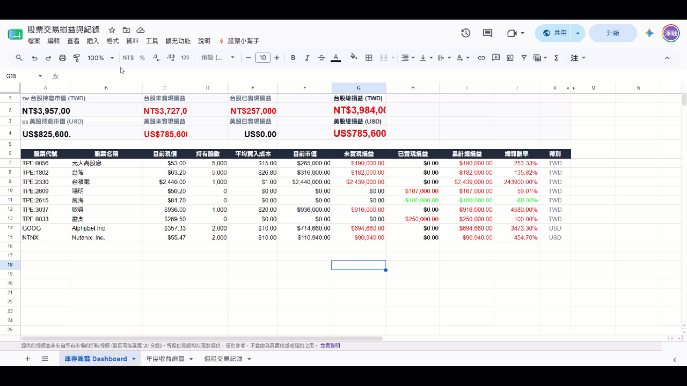
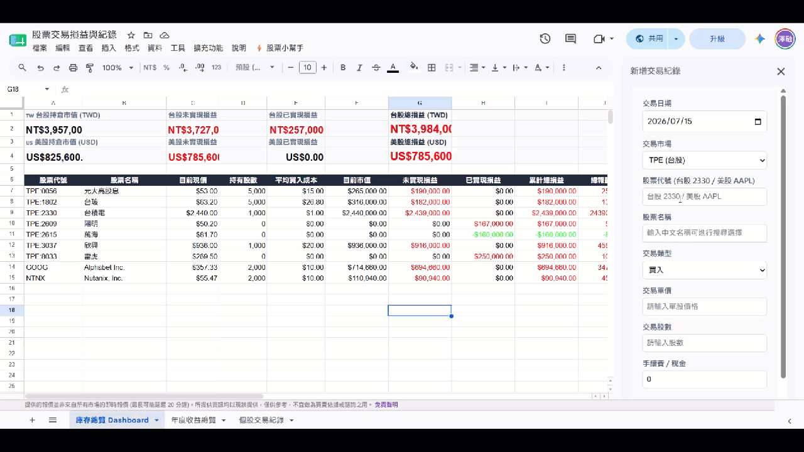
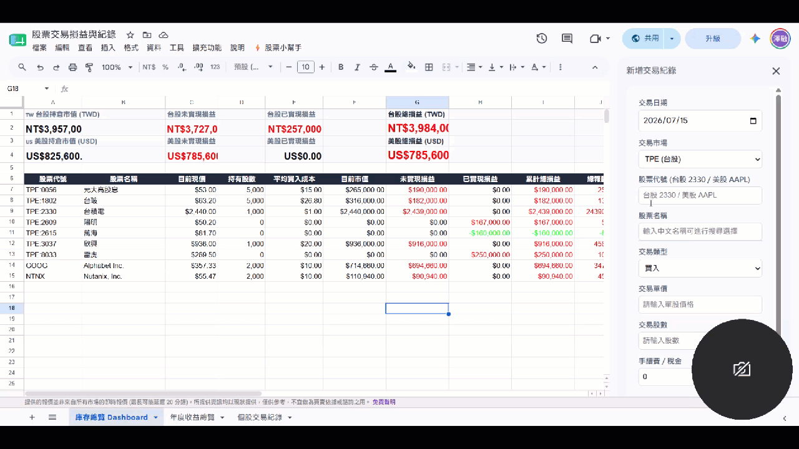

# 📈 Google 試算表股票小幫手 (GAS Stock Portfolio Helper)

這是一個基於 **Google Apps Script (GAS)** 開發的股票交易與庫存管理系統。透過本系統，您可以輕鬆地在 Google 試算表內輸入台股與美股交易，系統會自動使用**移動平均成本法**計算您的持倉成本、未實現損益、已實現損益，並生成美觀、自動適應欄寬的庫存總覽 Dashboard 與年度收益總覽報表。

---

## 🌟 核心功能

1. **💰 便捷買賣輸入 (Sidebar)**
   * 提供友好的側邊欄表單，支援日曆選單、市場切換。
   * **代號自動反查**：輸入股票代號（如 `2330` / `AAPL`）自動反查中文名稱與所屬市場。
   * **名稱模糊搜尋**：輸入中文關鍵字（如 `台積`），即時下拉列出匹配的股票代號供點選。

2. **📊 庫存總覽 Dashboard**
   * **台美股獨立統計**：台股 (TWD) 與美股 (USD) 分開計算，避免匯率混算。
   * **效能優化設計**：由 Apps Script 在背景完成重度計算並寫入靜態值，僅保留輕量 `GOOGLEFINANCE` 現價與基本算式，解決試算表因巨型公式導致的卡頓或崩潰。
   * **防縮排/破版機制**：每次更新時會自動重新調適欄寬，且針對非同步載入的 `GOOGLEFINANCE` 欄位提供最小安全寬度，防止顯示 `###` 或寬度過窄。

3. **📅 年度收益總覽 (已實現損益)**
   * 自動以年度為單位彙整已賣出部位的已實現損益、買入/賣出總額、手續費與交易筆數。
   * 自動生成底部的「合計」列，方便資產規劃與報稅。

4. **⚡ 自動同步**
   * 透過側邊欄點擊「確認送出」時，系統會自動在背景更新「庫存總覽 Dashboard」與「年度收益總覽」，無需手動點選功能選單。

---

## 📂 檔案結構

GAS 相關的所有程式碼皆存放在專案的 **`code/`** 資料夾中，您可以直接在 GitHub 上點開各個檔案複製程式碼，並貼到您的 Google Apps Script 編輯器內：
* `code/code.gs.js`：核心邏輯，包含選單建立、側邊欄調用、計算引擎、搜尋模組與 Dashboard 寫入。
* `code/YearReport.gs.js`：年度收益總覽報表寫入邏輯。
* `code/Sidebar.html`：側邊欄交易輸入表單 UI（包含前端防抖模糊搜尋）。

---

## 🛠️ 安裝與設定教學

### 步驟 1：建立試算表分頁 (已支援全自動建立！🎉)
本系統已支援**全自動初始化**。當您完成下述「步驟 2」部署好程式碼並重新整理後，系統會在您第一次執行以下任一動作時，自動在背景建立並排版好此分頁（包含表頭對齊與數字格式），您完全無需手動設定：
* 點選自訂選單中的 **`💰 買賣輸入`**、**`📊 建立/更新庫存總覽 Dashboard`** 或 **`📅 建立/更新年度收益總覽`**。
* 點選自訂選單中的 **`🛠️ 初始化交易紀錄分頁`**（手動主動初始化）。

*(備註：若您仍想手動建立，請建立一個名為 **`個股交易紀錄`** 的分頁，並在第 1 列的 A 到 H 欄依序輸入：`交易日期`、`股票代號`、`股票名稱`、`交易類型`、`交易單價`、`交易股數`、`手續費 / 稅金`、`損益/收支`)*

---

### 步驟 2：部署 Google Apps Script 程式碼
> 💡 **提示**：Google Apps Script 相關的原始碼檔案皆位於 GitHub 專案的 **`code/`** 資料夾下。您可以直接在 GitHub 上複製對應的程式碼內容貼入 Apps Script 內。

1. 在試算表上方選單點選 **「擴充功能」 (Extensions)** -> **「Apps Script」**。
2. 將預設的 `代碼.gs`（或建立新指令碼檔案）重新命名為 **`code.gs`**，並將專案中 **`code/code.gs.js`** 的內容複製貼上。
3. 建立一個新指令碼檔案命名為 **`YearReport.gs`**，並將專案中 **`code/YearReport.gs.js`** 的內容複製貼上。
4. 建立一個 HTML 檔案命名為 **`Sidebar`** (系統會自動加上 `.html` 擴充副檔名)，並將專案中 **`code/Sidebar.html`** 的內容複製貼上。
5. 點選上方「儲存專案」按鈕。

---

### 步驟 3：授權與啟用
1. 重新整理（F5）您的 Google 試算表網頁。
2. 重新整理後，上方選單最右側會出現 **`⚡️ 股票小幫手`** 自訂選單。
3. 點選 **`⚡️ 股票小幫手`** -> **`💰 買賣輸入`**，此時會彈出「需要授權」視窗：
   * 點選「繼續」。
   * 選擇您的 Google 帳戶。
   * 點選「進階」（Advanced）-> 點選「前往『未命名專案』(不安全)」（Go to ... (unsafe)）。
   * 點選「允許」（Allow）。
4. 授權完成後，再次點選選單功能即可正常使用。

---

## 📖 使用指南

### 1. 新增交易
* 點選 **`⚡️ 股票小幫手`** -> **`💰 買賣輸入`** 開啟交易輸入介面。
* **欄位自動同步與查詢機制**：
  * 當您輸入**股票代號**（如 `2330` 或 `AAPL`）並移開焦點後，系統會自動在背景反查並填入對應的股票名稱與市場。
  * 當您輸入**股票名稱**（如 `台積`）時，系統會自動觸發模糊搜尋，並在下方彈出下拉選單供您選擇。
  * ⚠️ *注意：由於非同步呼叫 Google 服務與證券相關 API，每次進行代號或名稱查詢時，約需等待 2-3 秒的處理時間。*
* 填寫選定交易類型（買入/賣出）、單價、股數、手續費，並點擊**「確認送出」**。
* 資料寫入後，系統將會**自動更新** Dashboard 與年度收益總覽。

### 2. 手動更新與重建
* 若您手動修改了 `個股交易紀錄` 中的舊資料，請務必手動觸發重建以更新統計數據：
  * **`📊 建立/更新庫存總覽 Dashboard`**
  * **`📅 建立/更新年度收益總覽`**

### 3. 切換輸入介面樣式 (Sidebar / Modeless / Modal)
* 系統提供多種輸入介面樣式，您可以透過點選 **`⚡️ 股票小幫手`** -> **`⚙ 設定輸入介面樣式`** 切換：
  * **側邊欄 (Sidebar)**：固定顯示於試算表右側（預設，寬度固定 300px）。
  * **浮動視窗 (Modeless Dialog)**：置中浮動的獨立小視窗，可自由拖曳、調整大小，且**不影響**您點擊或編輯背景的試算表。
  * **對話框 (Modal Dialog)**：置中浮動，但會暫時鎖定試算表，直到您點擊「確認送出」或關閉對話框。
* 選單中會使用 `✅` 與 `⬜` 圖示即時標記您目前正在使用的樣式。

---

## 💡 技術細節與注意事項

* **台股格式規範**：交易紀錄中的台股代號會自動被加上 `TPE:` 前綴（例如 `TPE:2330`），此為 GoogleFinance 抓取台股所必需的格式。
* **移動平均成本法**：系統採用先進先出與均價混合的移動平均成本法。若發生「超賣」（在未持有足夠股數下進行賣出），超賣部分的成本將以 $0 計算，且執行日誌中會出現 Warn 警示。
* **網速與 API 限制**：由於 Google 服務限制，搜尋台股上櫃名單已加上 6 小時的快取（Cache），避免重複呼叫櫃買中心 OpenAPI 造成延遲。
* **欄寬自適應效能優化 (COLUMN_RESIZE_MODE)**：
  * 若您發現更新 Dashboard 或年度收益總覽時較為緩慢，可在 `code.gs` 最上方的 `COLUMN_RESIZE_MODE` 設定中切換：
    * `'PRESET'`（預設，推薦！）：直接套用系統預設的最優欄寬，完全避開 Google 緩慢的排版寬度計算 API，大幅提升速度。
    * `'DYNAMIC'`：動態計算最長文字內容並調整欄寬限制（原本的行為，速度較慢）。
    * `'OFF'`：關閉自動調整欄寬，完全保留您手動拉好的寬度，速度最快。
